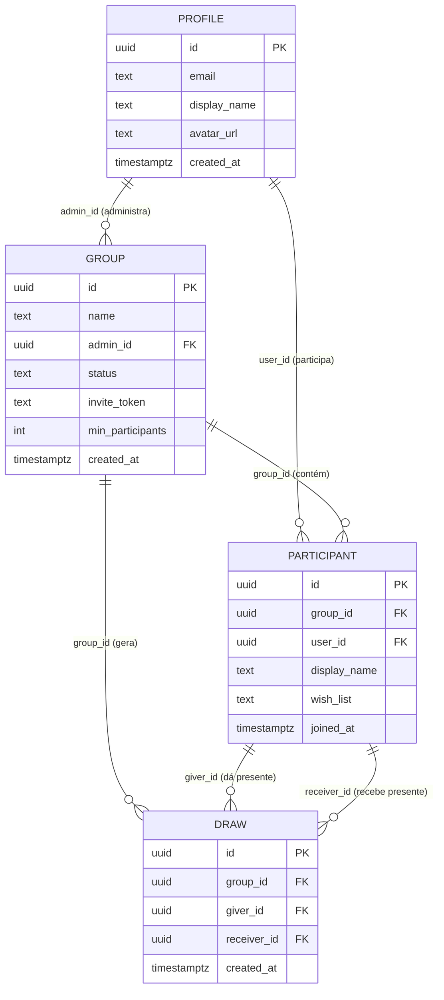
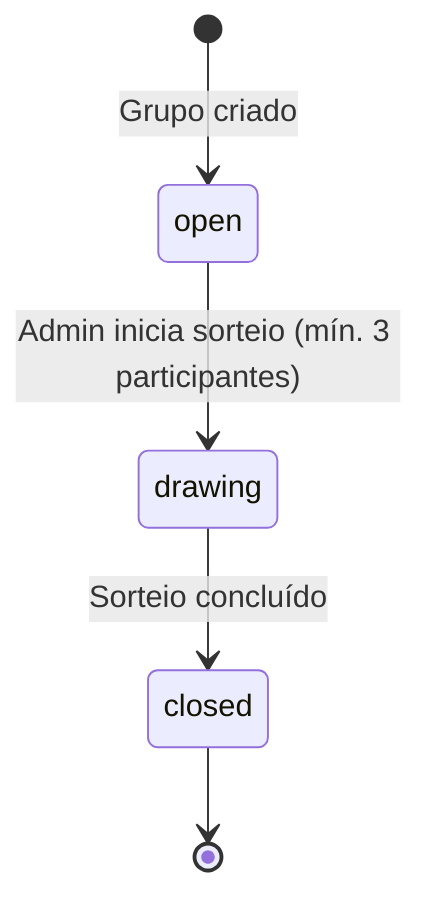

# 🛠️ Software Design Document (SDD)

**Projeto:** UTF-Secret — Sistema de Amigo Secreto Online
**Versão:** 1.0.0
**Status:** 🟡 Em Definição (MVP)

---

## 🤖 1. Orquestração e Contexto de IA (MCP)

> Configuração dos servidores Model Context Protocol para a IDE Agêntica.

* **Figma MCP:** `[LINK DO ARQUIVO FIGMA]` — Ler design tokens, cores, tipografia e hierarquia visual.
* **Supabase MCP:** Contexto do banco de dados real, schemas e políticas de RLS em tempo real.
* **GitHub MCP:** Leitura das Issues do Kanban para orientar a implementação (Spec-Driven Development).

---

## 📦 2. Stack Tecnológica e Bibliotecas

> Definição estrita das tecnologias permitidas. Nenhuma dependência externa deve ser instalada sem refletir aqui.

| Categoria | Tecnologia | Versão |
|:----------|:-----------|:-------|
| **Core** | Angular (Standalone + Signals) | 17+ |
| **BaaS & Auth** | Supabase JS | ^2.x |
| **Estilização** | Tailwind CSS | ^3.x |
| **UI Components** | Spartan UI (HLM) | latest |
| **Ícones** | Lucide Angular | latest |
| **Utilitários** | date-fns (datas) | ^3.x |
| **Validação** | Zod (schemas) | ^3.x |
| **Deploy** | Vercel | — |

---

## 🗄️ 3. Arquitetura de Dados

### 📖 3.1. Glossário Técnico (Mapeamento)

| Termo PRD (PT-BR) | Entidade Técnica (EN) | Atributos Principais |
|:------------------|:----------------------|:---------------------|
| Grupo | `group` | `id`, `name`, `admin_id`, `status`, `invite_token`, `created_at` |
| Participante | `participant` | `id`, `group_id`, `user_id`, `display_name`, `wish_list`, `joined_at` |
| Sorteio / Par Sorteado | `draw` | `id`, `group_id`, `giver_id`, `receiver_id`, `created_at` |
| Usuário | `profile` | `id`, `email`, `display_name`, `avatar_url` |

### 📊 3.2. Diagrama ER (Mermaid)



### 📌 3.3. Status do Grupo (State Machine)



---

## 📑 4. Contratos Globais (Interfaces & Types)

> Tipagem TypeScript baseada no banco de dados.

```typescript
export type GroupStatus = 'open' | 'drawing' | 'closed';

export interface Profile {
  id: string;
  email: string;
  display_name: string;
  avatar_url?: string;
  created_at: string;
}

export interface Group {
  id: string;
  name: string;
  admin_id: string;
  status: GroupStatus;
  invite_token: string;
  min_participants: number;
  created_at: string;
}

export interface Participant {
  id: string;
  group_id: string;
  user_id: string;
  display_name: string;
  wish_list?: string;
  joined_at: string;
}

export interface Draw {
  id: string;
  group_id: string;
  giver_id: string;
  receiver_id: string;
  created_at: string;
}

// View models para o frontend
export interface ParticipantWithProfile extends Participant {
  profile: Profile;
}

export interface MyDrawResult {
  receiver: Pick<Participant, 'display_name' | 'wish_list'>;
}
```

---

## 🏗️ 5. Scaffolding Macro (Arquitetura Frontend)

### 📂 5.1. Estrutura de Pastas Base

```
src/
├── app/
│   ├── core/
│   │   ├── services/
│   │   │   ├── auth.service.ts
│   │   │   ├── group.service.ts
│   │   │   └── draw.service.ts
│   │   ├── guards/
│   │   │   └── auth.guard.ts
│   │   └── interceptors/
│   │       └── error.interceptor.ts
│   ├── features/
│   │   ├── auth/
│   │   │   ├── login/
│   │   │   └── register/
│   │   ├── dashboard/
│   │   ├── group/
│   │   │   ├── create/
│   │   │   ├── manage/
│   │   │   └── join/
│   │   └── draw/
│   │       └── result/
│   └── shared/
│       ├── components/
│       │   ├── button/
│       │   ├── card/
│       │   └── modal/
│       └── pipes/
├── environments/
└── styles/
```

### 🚦 5.2. Mapa de Rotas e Páginas (Features)

| Rota | Page Component | Functional Guard |
|:-----|:---------------|:-----------------|
| `/login` | `features/auth/login/login.page.ts` | Público |
| `/register` | `features/auth/register/register.page.ts` | Público |
| `/dashboard` | `features/dashboard/dashboard.page.ts` | `authGuard` |
| `/group/create` | `features/group/create/create-group.page.ts` | `authGuard` |
| `/group/:id/manage` | `features/group/manage/manage-group.page.ts` | `authGuard` + `adminGuard` |
| `/join/:token` | `features/group/join/join-group.page.ts` | `authGuard` |
| `/draw/:groupId/result` | `features/draw/result/draw-result.page.ts` | `authGuard` |

### 🧠 5.3. Core Services (Singleton)

| Service | Arquivo | Responsabilidade Macro |
|:--------|:--------|:-----------------------|
| `AuthService` | `core/services/auth.service.ts` | Gerenciar sessão Supabase, estado do usuário logado (Signal) e fluxos de login/logout. |
| `GroupService` | `core/services/group.service.ts` | CRUD de grupos, geração de invite token, listagem de participantes. |
| `DrawService` | `core/services/draw.service.ts` | Executar algoritmo de sorteio, consultar par sorteado do usuário autenticado. |

---

## 🛡️ 6. Segurança (Supabase RLS)

> Políticas de acesso a nível de banco de dados — nenhum dado é exposto sem autenticação.

| Tabela | Política (RLS) |
|:-------|:---------------|
| `profile` | Usuário autenticado lê/edita apenas seu próprio perfil. |
| `group` | Admin lê e gerencia seus grupos. Participantes leem grupos que participam. |
| `participant` | Usuário lê todos os participantes do grupo que pertence. Edita apenas seus próprios dados. |
| `draw` | **Política crítica:** Participante (`giver_id`) lê **apenas sua própria linha** — nunca a de outro. Admin não possui acesso especial. |

---

## 📋 7. Algoritmo de Sorteio

O sorteio é executado em uma **Supabase Edge Function** (serverless) para garantir que a lógica não rode no cliente e nenhum par seja exposto:

```
1. Buscar todos os participant.id do grupo
2. Embaralhar a lista (Fisher-Yates shuffle)
3. Formar pares circulares: participante[i] → participante[i+1], último → primeiro
4. Garantir que nenhum participante tire a si mesmo
5. Inserir todos os pares na tabela `draw` em uma única transação
6. Atualizar group.status para 'closed'
```
