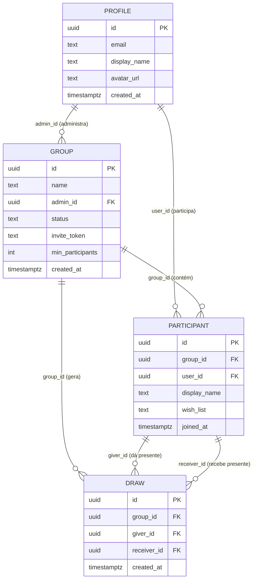
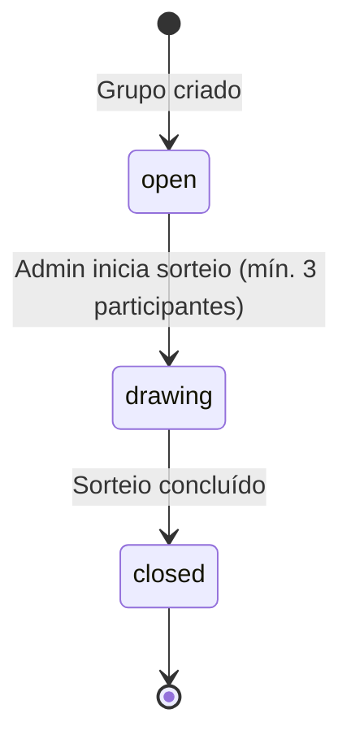

# 🛠️ Software Design Document (SDD)

**Projeto:** UTF-Secret — Sistema de Amigo Secreto Online
**Versão:** 1.0.0
**Status:** 🟡 Em Definição (MVP)

---

## 🤖 1. Orquestração e Contexto de IA (MCP)

> Servidores Model Context Protocol configurados na IDE agêntica (Claude Code).
> Requisito ENG-10 / indicador RA8-ID31.

### 1.1. Supabase MCP (obrigatório)

Servidor oficial hospedado, autenticação por OAuth — não há processo local para rodar.

```bash
claude mcp add --transport http supabase \
  "https://mcp.supabase.com/mcp?project_ref=<PROJECT_REF>&read_only=true"
```

- `project_ref` restringe o servidor a **um único** projeto Supabase; com o escopo definido, as
  ferramentas de gestão de conta (criar/apagar outros projetos) ficam desabilitadas.
- `read_only=true` é o padrão de segurança que a própria Supabase recomenda e é a configuração
  do projeto entregue: permite inspecionar schema, policies de RLS e logs sem poder executar
  migrations destrutivas pelo canal MCP.
- **Caveat de segurança (documentado deliberadamente):** conceder a um agente acesso de escrita
  ao banco via MCP significa que qualquer prompt injection que atinja a sessão do agente — vindo
  de conteúdo web buscado, da descrição de uma Pull Request, ou de qualquer texto não confiável
  que o agente leia — pode tentar emitir SQL pela conexão MCP. O escopo de um único projeto
  somado a `read_only=true` é a mitigação, não a eliminação do risco. A conexão MCP deve ser
  tratada com a mesma desconfiança de qualquer credencial com raio de alcance, e nunca deve
  apontar para um projeto de produção com escrita habilitada por padrão.

### 1.2. Figma MCP (obrigatório)

Servidor oficial remoto (não exige o app desktop do Figma):

```bash
claude mcp add --transport http figma "https://mcp.figma.com/mcp"
```

Uso: copiar o link de um frame/layer no modo Dev do Figma e colar no contexto do agente para
extrair design tokens, cores, tipografia e hierarquia visual. O arquivo do protótipo é o mesmo
linkado no README por UI-07.

### 1.3. Angular CLI MCP (opcional, adicional)

Embutido no próprio Angular CLI — não é um pacote separado:

```bash
npx @angular/cli mcp --read-only
```

Expõe `list_projects`, `run_target` (build/test/lint), `search_documentation` e
`get_best_practices`. Não é exigido pelo ENG-10 (que nomeia Supabase e Figma), mas é
diretamente relevante num projeto avaliado pelo uso correto das APIs modernas do Angular.
Flags `--read-only` e `--local-only` disponíveis para limitar o alcance.

---

## 📦 2. Stack Tecnológica e Bibliotecas

> Definição estrita das tecnologias permitidas. Nenhuma dependência externa deve ser instalada sem refletir aqui.

| Categoria | Tecnologia | Versão |
|:----------|:-----------|:-------|
| **Core** | Angular (Standalone + Signals) | **^21.x (LTS)** |
| **BaaS & Auth** | Supabase JS | ^2.x |
| **Estilização** | Tailwind CSS | **^4.x** |
| **UI Components** | Spartan UI (HLM) | ^1.7.x |
| **UI Primitives** | Angular CDK (peer do Spartan) | ^21.x |
| **Ícones** | Lucide Angular | ^1.x |
| **Utilitários** | date-fns (datas) | ^3.x |
| **Validação** | Zod (schemas) | ^3.x |
| **Testes** | Vitest (padrão do Angular 21+) | — |
| **Deploy** | Vercel | — |
| **Utilitários (peer do Spartan)** | clsx (composição de classes) | ^2.x |
| **Datas (peer do Spartan)** | luxon (uso interno dos componentes de data do Spartan) | ^3.x |
| **Animações (peer do Spartan)** | tw-animate-css | ^1.x |
| **PWA** | @angular/service-worker (Service Worker + manifest) | **^21.x** |
| **Build de ícones (dev)** | @resvg/resvg-js (rasterização SVG -> PNG, devDependency) | ^2.x |

### 2.1. Changelog de Versões (decisões tomadas em 2026-10-14)

As versões acima foram revisadas contra o registry do npm. Duas mudanças em relação à
v1.0.0 deste documento, ambas decididas deliberadamente:

| Item | Antes | Agora | Motivo |
|:-----|:------|:------|:-------|
| Angular | `17+` | `^21.x` (LTS) | O ID31 do checklist pede "Skills de Angular 20+", e o Spartan UI exige `@angular/core >=21 <23`. A v21 é o LTS mais recente que satisfaz ambos e evita o conflito de peer do `lucide-angular` (que declara suporte até a 21.x). Em v21+ o projeto nasce *zoneless* e com **Vitest** no lugar do Karma. |
| Tailwind CSS | `^3.x` | `^4.x` | **Conflito bloqueante:** `@spartan-ng/brain@1.7.0` declara `peerDependencies.tailwindcss: ">=4.0.0"`. Manter o Tailwind 3 tornaria impossível instalar o Spartan UI (`ERESOLVE`). O guia oficial do Angular também só documenta o setup do v4. O ID4 do checklist pede apenas "um framework CSS moderno", então a troca não afeta a avaliação. |

**Consequência prática do Tailwind v4:** não existe mais `tailwind.config.js`. A
configuração passa a ser *CSS-first*: `@import "tailwindcss";` no `styles.css` e o tema
definido em um bloco `@theme { ... }`. O PostCSS usa o plugin `@tailwindcss/postcss`.

**Observação:** o Spartan UI também traz `luxon` como peer dependency. Isso convive sem
problema com o `date-fns` já adotado — o `luxon` é usado internamente por componentes de
data do Spartan, enquanto o `date-fns` continua sendo a biblioteca de datas da aplicação.

**Peers transitivos do Spartan UI (adicionados em 2026-10-14).** O `@spartan-ng/brain@1.7.0`
declara `clsx >=2.0.0`, `luxon >=3.0.0` e `tw-animate-css >=1.0.0` como peer dependencies.
Elas entram na tabela acima por força da regra "nenhuma dependência sem refletir aqui". O
`luxon` convive com o `date-fns` sem conflito: o `luxon` serve aos componentes de data internos
do Spartan, e o `date-fns` continua sendo a biblioteca de datas da aplicação. Nota de instalação
(plan 01-03): `luxon` está marcado `peerDependenciesMeta.optional: true` no `@spartan-ng/brain@1.7.0`
instalado — como a Fase 1 só gerou `button` e `card` (nenhum componente de data do Spartan), o
npm não o instalou automaticamente. Ele será instalado quando a primeira fase que usa um
componente de data do Spartan (ex. date-picker/calendar) o exigir; a entrada na tabela já
documenta a dependência com antecedência, conforme a regra do SDD.

**Primitivas Spartan UI geradas (atualizado na Fase 2).** O `libs/ui/` contém apenas as
primitivas efetivamente usadas, geradas sob demanda por `ng g @spartan-ng/cli:ui <nome>`:
`utils`, `button` e `card` (Fase 1) e `input` + `label` (Fase 2, para os Reactive Forms de
login e cadastro). Isso é **geração de código local**, não instalação de dependência: as
`peerDependencies` de `input` e `label` são apenas `@angular/core`, `@angular/forms` e
`@spartan-ng/brain`, todas já presentes na tabela §2 — `package.json` não muda ao gerá-las.

A primitiva `field` (o "form field" do Spartan) foi deliberadamente **não** gerada: ela
depende de `separator` e puxa `@ng-icons/core` + `@ng-icons/lucide` como peers, que não
constam da §2. Rótulo (`hlmLabel`) + campo (`hlmInput`) + um parágrafo de mensagem de erro
já atendem o ID23 do checklist sem ampliar a árvore de dependências.

**Fase 3 não gerou nenhuma primitiva Spartan nova.** A confirmação de remoção de
participante (GRP-05) foi deliberadamente implementada como uma confirmação inline em dois
passos (um signal guardando o id em confirmação, alternando botões via `@if`), em vez da
primitiva `dialog`: `dialog` arrastaria `@ng-icons/core` + `@ng-icons/lucide` como peers,
ausentes da tabela §2 — exatamente a mesma razão que levou a não gerar `field` acima.

#### Adições da Fase 5 (2026-10-15)

| Item | Decisão | Motivo |
|:-----|:--------|:-------|
| `@angular/service-worker` | Adicionado (D-01 da Fase 5) | É o único caminho em que o Lighthouse marca o app como *Installable* sem ressalva, que é literalmente o critério 1 do ROADMAP da fase. Pinado na linha **21**, igual a `@angular/core` e `@angular/cdk`, para não repetir o conflito de peers da Fase 1. |
| `@resvg/resvg-js` | Adicionado como **devDependency** (D-04 da Fase 5) | O Lighthouse exige ícones **PNG** reais (192x192, 512x512 e um 512x512 `maskable` separado); SVG no manifest não é honrado de forma confiável por iOS Safari nem por vários launchers Android. O `jsdom` já instalado **não** rasteriza — `HTMLCanvasElement.getContext('2d')` lança `Not implemented... without installing the canvas npm package`, verificado empiricamente neste projeto — logo uma dependência nova era inevitável. Escolhido em vez de `sharp` por ser zero-dependency (Rust/napi-rs, binários pré-compilados) e de propósito único. Usado **apenas** por um script de build em `scripts/`, nunca importado por código da aplicação nem enviado ao bundle do browser. |

---

## 🗄️ 3. Arquitetura de Dados

### 📖 3.1. Glossário Técnico (Mapeamento)

| Termo PRD (PT-BR) | Entidade Técnica (EN) | Atributos Principais |
|:------------------|:----------------------|:---------------------|
| Grupo | `group` | `id`, `name`, `admin_id`, `status`, `invite_token`, `created_at` |
| Participante | `participant` | `id`, `group_id`, `user_id`, `display_name`, `wish_list`, `joined_at` |
| Sorteio / Par Sorteado | `draw` | `id`, `group_id`, `giver_id`, `receiver_id`, `created_at` |
| Usuário | `profile` | `id`, `email`, `display_name`, `avatar_url` |

### 📊 3.2. Diagrama ER (Mermaid)


```mermaid
erDiagram
    PROFILE {
        uuid id PK
        text email
        text display_name
        text avatar_url
        timestamptz created_at
    }

    GROUP {
        uuid id PK
        text name
        uuid admin_id FK
        text status
        text invite_token
        int min_participants
        timestamptz created_at
    }

    PARTICIPANT {
        uuid id PK
        uuid group_id FK
        uuid user_id FK
        text display_name
        text wish_list
        timestamptz joined_at
    }

    DRAW {
        uuid id PK
        uuid group_id FK
        uuid giver_id FK
        uuid receiver_id FK
        timestamptz created_at
    }

    PROFILE ||--o{ GROUP : "admin_id (administra)"
    PROFILE ||--o{ PARTICIPANT : "user_id (participa)"
    GROUP ||--o{ PARTICIPANT : "group_id (contém)"
    GROUP ||--o{ DRAW : "group_id (gera)"
    PARTICIPANT ||--o{ DRAW : "giver_id (dá presente)"
    PARTICIPANT ||--o{ DRAW : "receiver_id (recebe presente)"
```

### 📌 3.3. Status do Grupo (State Machine)


```mermaid
stateDiagram-v2
    [*] --> open : Grupo criado
    open --> drawing : Admin inicia sorteio (mín. 3 participantes)
    drawing --> closed : Sorteio concluído
    closed --> [*]
```

---

## 📑 4. Contratos Globais (Interfaces & Types)

> Tipagem TypeScript baseada no banco de dados.

```typescript
export type GroupStatus = 'open' | 'drawing' | 'closed';

export interface Profile {
  id: string;
  email: string;
  display_name: string;
  avatar_url?: string;
  created_at: string;
}

export interface Group {
  id: string;
  name: string;
  admin_id: string;
  status: GroupStatus;
  invite_token: string;
  min_participants: number;
  created_at: string;
}

export interface Participant {
  id: string;
  group_id: string;
  user_id: string;
  display_name: string;
  wish_list?: string;
  joined_at: string;
}

export interface Draw {
  id: string;
  group_id: string;
  giver_id: string;
  receiver_id: string;
  created_at: string;
}

// View models para o frontend
export interface ParticipantWithProfile extends Participant {
  profile: Profile;
}

export interface DrawResult {
  id: string;
  receiver: Pick<Participant, 'display_name' | 'wish_list'>;
}
```

> Nota (plan 04-04): o nome real no código é `DrawResult`, não `MyDrawResult` — e
> inclui `id` (o id da própria linha de `draw`), usado só para `track` no `@for`/debug.
> Divergência mínima registrada aqui em vez de renomear o contrato já em uso.

---

## 🏗️ 5. Scaffolding Macro (Arquitetura Frontend)

### 📂 5.1. Estrutura de Pastas Base

> Atualizado ao final da Fase 3 (D-07) para refletir a árvore real em disco
> (`find src/app -type d`), não a previsão original da v1.0.0.

```
src/
├── app/
│   ├── core/
│   │   ├── models/
│   │   │   └── group.model.ts            # Group, Participant, JoinResult, GroupPreview (§4)
│   │   ├── services/
│   │   │   ├── supabase-client.service.ts
│   │   │   ├── auth.service.ts
│   │   │   ├── group.service.ts
│   │   │   ├── holiday.service.ts        # BrasilAPI (API-01..04)
│   │   │   ├── draw.service.ts           # Fase 4
│   │   │   └── connectivity.service.ts   # Fase 5 - status online/offline (UI-05, RA3-ID12)
│   │   ├── guards/
│   │   │   ├── auth.guard.ts
│   │   │   ├── admin.guard.ts            # só o admin abre /group/:id/manage
│   │   │   └── member.guard.ts           # qualquer membro abre /group/:id
│   │   ├── resolvers/
│   │   │   └── group.resolver.ts
│   │   ├── interceptors/
│   │   │   └── error.interceptor.ts
│   │   ├── auth-error-messages.ts
│   │   ├── join-error-messages.ts
│   │   └── dias-ate-natal.ts
│   ├── features/
│   │   ├── auth/
│   │   │   ├── login/
│   │   │   └── register/
│   │   ├── shell/                        # authenticated-layout.page (rota pai, authGuard)
│   │   ├── dashboard/                    # dashboard.page + christmas-countdown.card
│   │   ├── group/
│   │   │   ├── group.routes.ts
│   │   │   ├── group-layout/
│   │   │   ├── create/
│   │   │   ├── view/                     # group-view.page — tela do PARTICIPANTE
│   │   │   ├── manage/                   # manage-group.page + participant-row (admin)
│   │   │   └── join/
│   │   └── draw/
│   │       └── result/                   # Fase 4
│   └── shared/                           # components/ e pipes/ existem como pastas
│       ├── components/                   # vazias (só .gitkeep) — criadas quando
│       └── pipes/                        # houver reuso real, nenhum até a Fase 3
├── environments/
└── styles.css
public/
├── manifest.webmanifest              # Fase 5 - PWA (UI-03)
└── icons/                            # icon-192x192, icon-512x512, icon-512x512-maskable
```

### 🚦 5.2. Mapa de Rotas e Páginas (Features)

> Atualizado ao final da Fase 3 (D-07): a tabela da v1.0.0 listava tudo "flat", o que
> havia divergido da árvore real de rotas aninhadas. Abaixo, a hierarquia real e onde
> cada guard/resolver atua.

| Rota | Page Component | Guard / Resolver |
|:-----|:---------------|:-----------------|
| `/login` | `features/auth/login/login.page.ts` | Público |
| `/register` | `features/auth/register/register.page.ts` | Público |
| *(rota pai sem path)* | `features/shell/authenticated-layout.page.ts` | **`authGuard`** — aplicado UMA vez; todas as rotas abaixo herdam |
| └ `/dashboard` | `features/dashboard/dashboard.page.ts` | herda `authGuard` |
| └ `/group` *(layout)* | `features/group/group-layout/group-layout.page.ts` | herda `authGuard` |
| &nbsp;&nbsp;&nbsp;└ `/group/create` | `features/group/create/create-group.page.ts` | herda `authGuard` |
| &nbsp;&nbsp;&nbsp;└ `/group/:id` | `features/group/view/group-view.page.ts` | herda `authGuard` + **`memberGuard`** (`canActivate`) |
| &nbsp;&nbsp;&nbsp;└ `/group/:id/manage` | `features/group/manage/manage-group.page.ts` | herda `authGuard` + **`adminGuard`** (`canActivate`) + **`groupResolver`** (`resolve`) |
| └ `/join/:token` | `features/group/join/join-group.page.ts` | herda `authGuard` (deep link via `returnUrl`) |
| └ `/draw/:groupId/result` | `features/draw/result/draw-result.page.ts` | herda `authGuard` + **`memberGuard`** (`canActivate`) + **`drawResultResolver`** (`resolve`) |

**Hierarquia de layout (RA5-ID17).** `/group/create` e `/group/:id/manage` são rotas
**filhas** de um `GroupLayoutPage` com `<router-outlet>` próprio, que por sua vez é filho da
rota de layout autenticado. `/join/:token` é deliberadamente **flat** (fora de `/group`):
quem abre um convite ainda não é membro, e renderizar o layout de um grupo que a pessoa não
integra seria incoerente.

**Duas rotas de grupo, dois papéis (fechamento da Fase 3).** `/group/:id` é a tela do
**participante** (`GroupViewPage`: nome do grupo, lista de colegas e a própria lista de
desejos) e `/group/:id/manage` é a tela do **administrador** (`ManageGroupPage`: link de
convite e remoção de participantes). Guards distintos: `memberGuard` admite qualquer
membro — admin ou participante — enquanto o `adminGuard` exige
`group.admin_id === auth.uid()`.

A alternativa avaliada e rejeitada foi afrouxar o `adminGuard` e esconder os controles do
admin com `@if (souAdmin())` dentro de `ManageGroupPage`. Dois papéis no mesmo componente
fariam de um `@if` de template a única barreira visual entre eles; a proteção real
continuaria nas policies, mas a tela ficaria fácil de quebrar por engano. Um admin que
também é participante do próprio grupo abre `/group/:id` normalmente (é lá que ele edita
a própria wishlist) e encontra ali um link para `/manage`.

`memberGuard` não consulta `participant`: as duas policies de `SELECT` em `group` são
ORed pela RLS (`admin_id = auth.uid()` OU `id in (select private.my_group_ids())`), então
"a RLS devolveu a linha" já é equivalente a "sou membro ou admin", e um estranho recebe
`null`. `/group/:id` também dispensa o `groupResolver`: o guard já chamou `loadGroup`, que
popula `GroupService.currentGroup`, de onde o componente lê — uma query por navegação.

**Sobre o `adminGuard` previsto na v1.0.0 deste documento.** Ele existe, em
`core/guards/admin.guard.ts`, e está ligado em `canActivate` na rota `:id/manage`.

Durante a Fase 3 houve uma tentativa de dispensá-lo, pondo a checagem de "só o admin acessa
`/group/:id/manage`" **dentro do `groupResolver`**, que devolveria um `UrlTree` para
`/dashboard` quando `admin_id` não fosse o usuário da sessão. O argumento era evitar uma
segunda query por navegação, já que o Angular Router executa os `canActivate` **antes** dos
`resolve` da mesma rota e um guard não conseguiria reaproveitar o grupo buscado pelo resolver.

**Isso não funciona, e o defeito foi observado em produção na verificação manual da fase:**
um `UrlTree` devolvido por um `ResolveFn` **não redireciona**. Ao contrário de
`CanActivateFn` — onde o `UrlTree` é o contrato oficial de redirecionamento — o valor
devolvido por um resolver é apenas colocado em `route.data`. A rota ativava normalmente, um
participante não-admin abria a tela de gestão de um grupo alheio, e o componente recebia um
`UrlTree` onde esperava um `Group` (daí o cabeçalho renderizando vazio).

A checagem vive agora no `adminGuard` (`CanActivateFn`), que roda antes de a rota ativar. O
`groupResolver` ficou apenas com o carregamento do grupo. O custo é a tal segunda chamada a
`loadGroup` por navegação — preço aceito em troca de correção. Coberto por
`admin.guard.spec.ts` (4 casos), incluindo o do não-admin barrado.

### 🧠 5.3. Core Services (Singleton)

> Linha do `GroupService` e `HolidayService` atualizadas ao final da Fase 3 (D-07).

| Service | Arquivo | Responsabilidade Macro |
|:--------|:--------|:-----------------------|
| `AuthService` | `core/services/auth.service.ts` | Gerenciar sessão Supabase, estado do usuário logado (Signal) e fluxos de login/logout. |
| `GroupService` | `core/services/group.service.ts` | CRUD de grupos, listagem/remoção de participantes, atualização da própria wishlist e os RPCs de `public`: `create_group` (0006 — cria o grupo E insere o admin como participante na mesma transação, D-01/D-02 da Fase 4), `join_group_by_token` e `preview_group_by_token` (0004). Estado em `signal()`, re-buscado após cada mutação. Não escreve `group.status` — isso pertence à Edge Function do sorteio. |
| `HolidayService` | `core/services/holiday.service.ts` | `GET` à BrasilAPI via `HttpClient`, ponte Observable→Signal com `toSignal()` e cálculo de dias até o Natal. Único tráfego do projeto que passa por `HttpClient` e, portanto, pelos interceptors. |
| `DrawService` | `core/services/draw.service.ts` | Invoca a Edge Function `run-draw` via `supabase.functions.invoke()` (DRAW-01/02) e traduz os códigos estáveis de erro com `draw-error-messages.ts` (D-12). Nenhuma lógica de sorteio vive no cliente. `getMyResult(groupId)` (plan 04-04, D-07/DRAW-09) busca o par do usuário numa única query com join FK-nomeado (`participant!draw_receiver_id_fkey`), consumida por `drawResultResolver`. |

---

## 🛡️ 6. Segurança (Supabase RLS)

> Políticas de acesso a nível de banco de dados — nenhum dado é exposto sem autenticação.

| Tabela | Política (RLS) |
|:-------|:---------------|
| `profile` | Usuário autenticado lê/edita apenas seu próprio perfil. |
| `group` | Admin lê e gerencia seus grupos. Participantes leem grupos que participam. |
| `participant` | Usuário lê todos os participantes do grupo que pertence. Edita apenas seus próprios dados. |
| `draw` | **Política crítica:** Participante (`giver_id`) lê **apenas sua própria linha** — nunca a de outro. Admin não possui acesso especial. |

---

## 📋 7. Algoritmo de Sorteio

O sorteio é executado em uma **Supabase Edge Function** (serverless) para garantir que a lógica não rode no cliente e nenhum par seja exposto:

```
1. Buscar todos os participant.id do grupo
2. Embaralhar a lista (Fisher-Yates shuffle)
3. Formar pares circulares: participante[i] → participante[i+1], último → primeiro
4. Garantir que nenhum participante tire a si mesmo
5. Inserir todos os pares na tabela `draw` em uma única transação
6. Atualizar group.status para 'closed'
```
